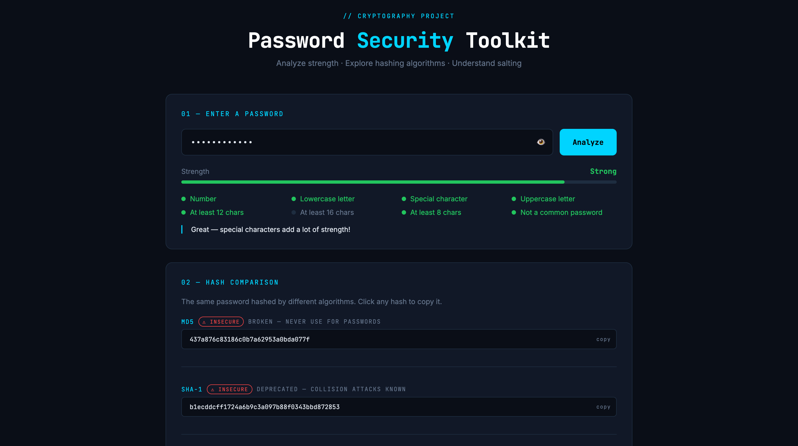

# 🔐 Password Security Toolkit
🌐 **Live Demo:** [password-security-toolkit.onrender.com](https://your-actual-link.onrender.com)
A beginner-friendly cryptography project that analyzes password strength and demonstrates real hashing algorithms — built with Python and Flask.

## What It Does

- **Strength Analysis** — scores passwords across length, character variety, and common-password detection
- **Hash Comparison** — hashes your password with MD5, SHA-1, SHA-256, SHA-512, and bcrypt side by side
- **Salting Demo** — visually explains how salting defeats rainbow table attacks
- **Algorithm Security Guide** — labels each algorithm as insecure, use carefully, or recommended

## Concepts Covered

| Concept | What you learn |
|---|---|
| Hashing | One-way functions that can't be reversed |
| MD5 / SHA-1 | Why older algorithms are considered broken |
| SHA-256 / SHA-512 | Stronger alternatives, but still vulnerable without salting |
| Salting | Random values that make identical passwords hash differently |
| bcrypt | The gold standard — deliberately slow, built-in salt |

## Tech Stack

- **Python 3.10+**
- **Flask** — lightweight web framework
- **bcrypt** — industry-standard password hashing
- **hashlib** — Python's built-in hashing library
- Vanilla HTML / CSS / JS (no frontend framework needed)

## Getting Started

```bash
# 1. Clone the repo
git clone https://github.com/YOUR_USERNAME/password-security-toolkit.git
cd password-security-toolkit

# 2. Create a virtual environment
python -m venv venv
source venv/bin/activate      # Windows: venv\Scripts\activate

# 3. Install dependencies
pip install -r requirements.txt

# 4. Run the app
python app.py
```

Then open [http://localhost:5000](http://localhost:5000) in your browser.

## Project Structure

```
password-security-toolkit/
├── app.py               # Flask backend — strength analysis & hashing logic
├── templates/
│   └── index.html       # Frontend UI
├── requirements.txt
└── README.md
```

## Screenshots


## What I Learned

- How password hashing works under the hood
- Why MD5 and SHA-1 are deprecated for passwords
- The role of salting in preventing rainbow table attacks
- How bcrypt's computational cost makes brute-force impractical
- Building a full-stack web app with Flask

## Author

Built by [Your Name](https://github.com/YOUR_USERNAME) as a cybersecurity learning project.

## License

MIT
